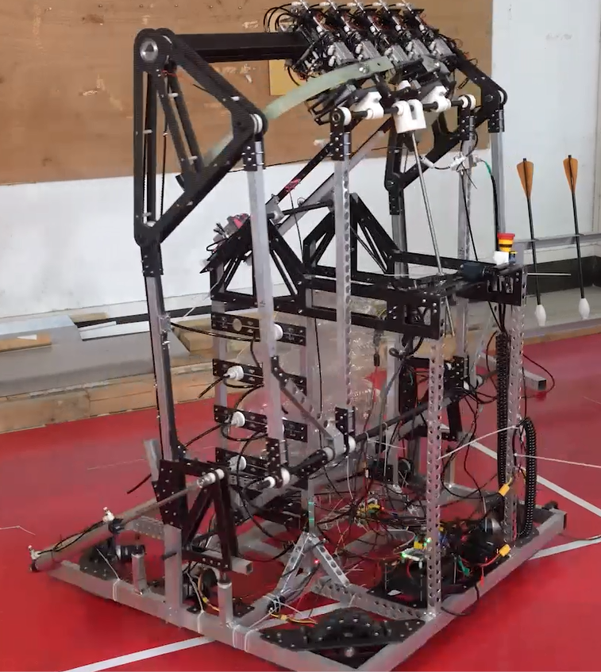
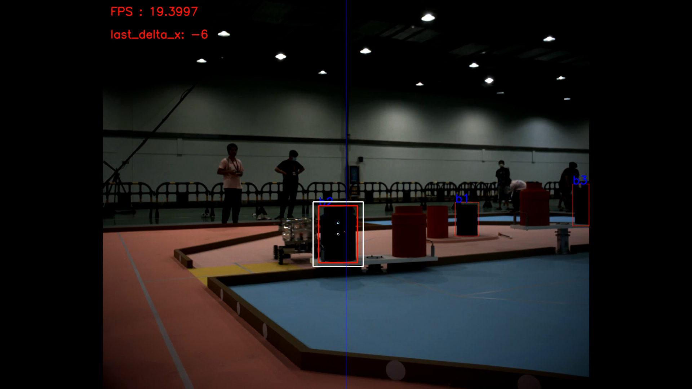
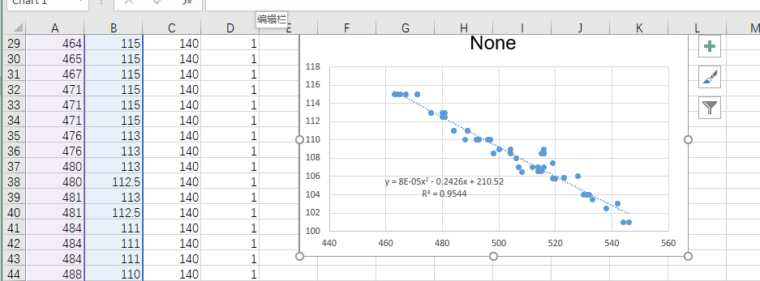
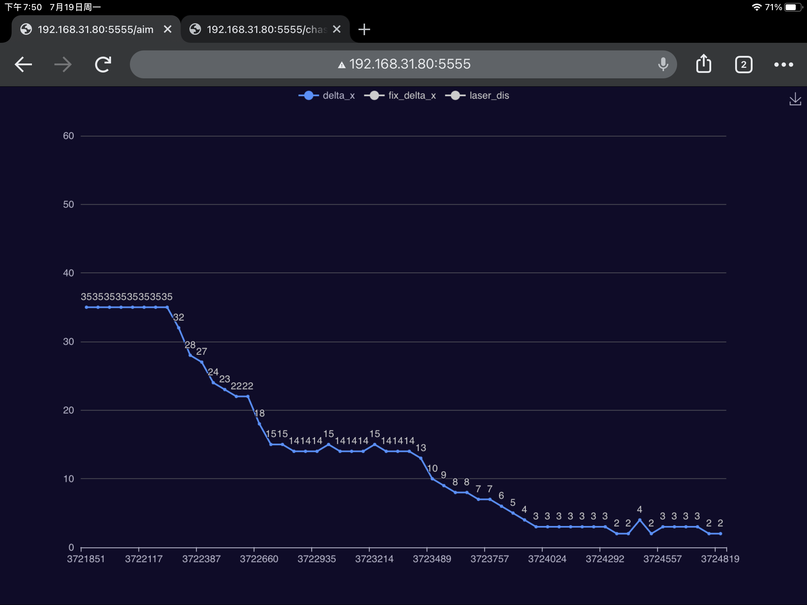
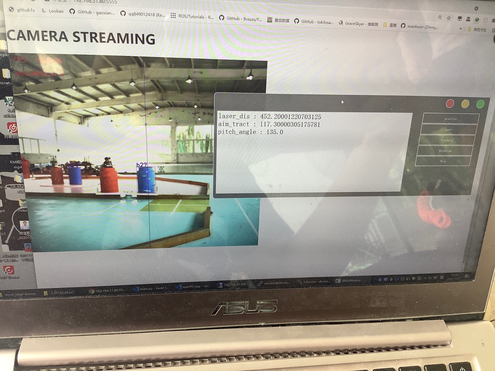

# Robocon_CV

## 整体方案介绍
我们的机器人的结构如下图所示  
  
我们采用的是单目RGB相机+TOF测距的方案。  
从单片机接收到想要瞄准的桶的编号，单目相机得到图像后使用YOLOv4-tiny训练后的红、蓝模型得到目标桶的位置，计算目标桶与当前视角中线之间的像素偏差，根据相机视场角近似算出像素值对应的转角,单片机对底盘进行闭环控制。

通过拟合曲线的方式，实现拉弓长度和桶距离的关系映射。由于各种各样的误差，实际上在使用拟合公式的时候，调整了截距以实现比较好的命中率。


### 效果展示

### 设备型号
1. 相机:大恒工业相机MER-139-210U3C
2. TOF:北醒光子TFmini-S
3. 电脑:Inter NUC8
4. 通信:USB-TTL串口

### 一些定义
关于桶的编号，从己方视角来看为  
```
  2  
1 3 5  
  4
``` 

即一型桶为1、5，二型桶为2、4，三型桶为3。  
在视角内能同时识别到2和4号桶的时候，根据机器人所在位置，判断瞄准的是左边的还是右边的桶

## 参考资料

本代码在实现过程中，使用到了非常多的开源资料，以下是其中的一部分

1. [co](https://github.com/idealvin/co)
2. [WzSerialportPlus](https://github.com/ayowin/WzSerialportPlus)
3. [webcam-http-streamer](https://github.com/s4mu313/webcam-http-streamer)

还有很多在做RoboMaster时参考了的代码，例如上交和深圳大学的视觉开源，非常感谢。  
特别说明的一条是，在使用co与OpenCV时，由于我比较菜，不会解决命名空间有冲突的问题，所以额外对co中的命名空间进行了修改再编译，这个可以在[main.cpp](https://github.com/DHU-Domino/Robocon_CV/blob/main/main.cpp#L84)中发现到。

## 配置文件
setting.xml中包含了颜色模型的选择，各个位置对应各个桶的修正像素值，录像保存，曝光调整等参数，改后重启程序即可。

## 小工具
### 视频流实时显示
借助了webcam-http-streamer开源代码，简单实现了在实验室WiFi信号良好条件下的远程[监控相机](https://github.com/DHU-Domino/Robocon_CV/blob/main/main.cpp#L112)的功能

### echart数据展示
由于机器人没有云台，机器人在自瞄过程中需要进行Yaw轴的旋转，所以通过co中的Json和Http将底盘和Yaw偏差的数据上传，然后用网页echart显示实时的数据，界面不好看，但是调PID的时候比较实用。


### 打标签上位机
自瞄是由单片机进行1开0关的，在每一次下降沿的时候读取TOF测距值，将单片机发送给电脑的拉弓长度和测距值都通过co中的Json和Http上传，用PyQt5进行数据接收和打标，结果保存在excel内。


### 开机启动脚本

```sh
    sudo cp /home/domino/robocon/run_domino.service /etc/systemd/system/
    sudo systemctl daemon-reload
    sudo systemctl enable run_domino.service
    sudo systemctl start run_domino.service
    sudo systemctl status run_domino.service
```

## 联系方式
QQ:496738668
